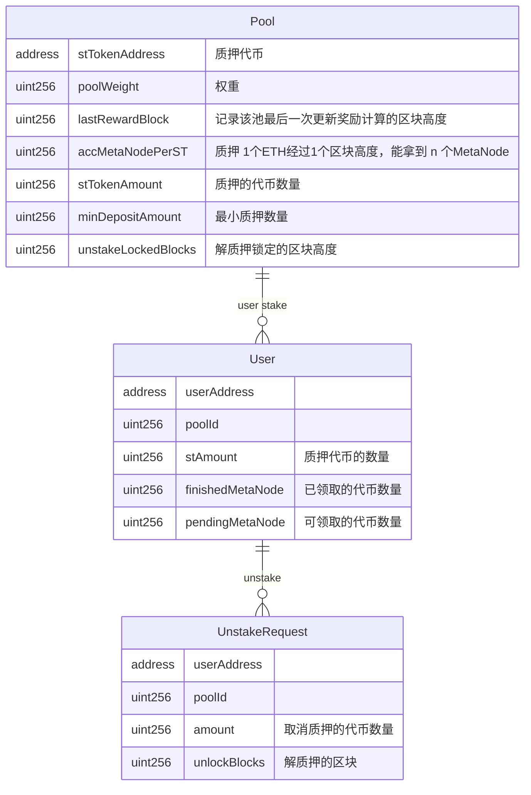
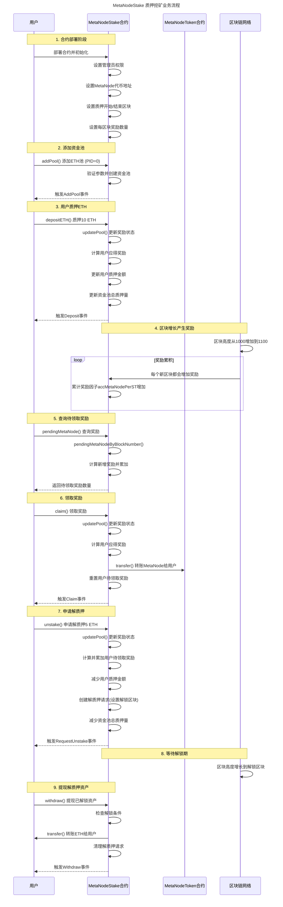

```mermaid
erDiagram
    Pool {
        address stTokenAddress "质押代币"
        uint256 poolWeight "权重"
        uint256 lastRewardBlock "记录该池最后一次更新奖励计算的区块高度"
        uint256 accMetaNodePerST "质押 1个ETH经过1个区块高度，能拿到 n 个MetaNode"
        uint256 stTokenAmount "质押的代币数量"
        uint256 minDepositAmount "最小质押数量"
        uint256 unstakeLockedBlocks "解质押锁定的区块高度"
    }
    
    Pool ||--o{ User : "user stake"
    
    User {
        address userAddress
        uint256 poolId
        uint256 stAmount "质押代币的数量"
        uint256 finishedMetaNode "已领取的代币数量"
        uint256 pendingMetaNode "可领取的代币数量"
    }
    
    User ||--o{ UnstakeRequest : "unstake"
    
    UnstakeRequest {
    	address userAddress ""
    	uint256 poolId
        uint256 amount "取消质押的代币数量"
        uint256 unlockBlocks "解质押的区块"
    }


```

```mermaid
sequenceDiagram
    participant U as 用户
    participant C as MetaNodeStake合约
    participant T as MetaNodeToken合约
    participant B as 区块链网络

    title MetaNodeStake 质押挖矿业务流程
    
    Note over U,C: 1. 合约部署阶段
    U->>C: 部署合约并初始化
    C->>C: 设置管理员权限
    C->>C: 设置MetaNode代币地址
    C->>C: 设置质押开始/结束区块
    C->>C: 设置每区块奖励数量
    
    Note over U,C: 2. 添加资金池
    U->>C: addPool() 添加ETH池 (PID=0)
    C->>C: 验证参数并创建资金池
    C-->>U: 触发AddPool事件
    
    Note over U,C: 3. 用户质押ETH
    U->>C: depositETH() 质押10 ETH
    C->>C: updatePool() 更新奖励状态
    C->>C: 计算用户应得奖励
    C->>C: 更新用户质押金额
    C->>C: 更新资金池总质押量
    C-->>U: 触发Deposit事件
    
    Note over B,C: 4. 区块增长产生奖励
    B->>B: 区块高度从1000增加到1100
    loop 奖励累积
        B->>C: 每个新区块都会增加奖励
        C->>C: 累计奖励因子accMetaNodePerST增加
    end
    
    Note over U,C: 5. 查询待领取奖励
    U->>C: pendingMetaNode() 查询奖励
    C->>C: pendingMetaNodeByBlockNumber()
    C->>C: 计算新增奖励并累加
    C-->>U: 返回待领取奖励数量
    
    Note over U,C: 6. 领取奖励
    U->>C: claim() 领取奖励
    C->>C: updatePool() 更新奖励状态
    C->>C: 计算用户应得奖励
    C->>T: transfer() 转账MetaNode给用户
    C->>C: 重置用户待领取奖励
    C-->>U: 触发Claim事件
    
    Note over U,C: 7. 申请解质押
    U->>C: unstake() 申请解质押5 ETH
    C->>C: updatePool() 更新奖励状态
    C->>C: 计算并累加用户待领取奖励
    C->>C: 减少用户质押金额
    C->>C: 创建解质押请求(设置解锁区块)
    C->>C: 减少资金池总质押量
    C-->>U: 触发RequestUnstake事件
    
    Note over B,C: 8. 等待解锁期
    B->>B: 区块高度增长到解锁区块
    
    Note over U,C: 9. 提现解质押资产
    U->>C: withdraw() 提现已解锁资产
    C->>C: 检查解锁条件
    C->>U: transfer() 转账ETH给用户
    C->>C: 清理解质押请求
    C-->>U: 触发Withdraw事件
```

